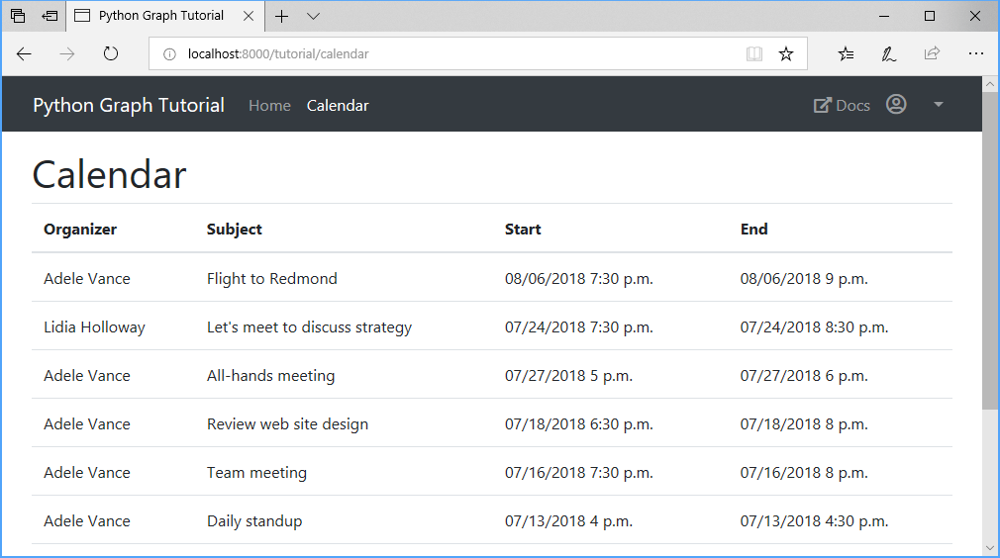

<!-- markdownlint-disable MD002 MD041 -->

この演習では、Microsoft Graph をアプリケーションに組み込みます。 このアプリケーションでは、[要求-OAuthlib](https://requests-oauthlib.readthedocs.io/en/latest/)ライブラリを使用して Microsoft Graph への呼び出しを行います。

## <a name="get-calendar-events-from-outlook"></a>Outlook からカレンダー イベントを取得する

1. 最初に、 **/tutorial/graph_helper py**にメソッドを追加して、予定表イベントを取得します。 次のメソッドを追加します。

    :::code language="python" source="../demo/graph_tutorial/tutorial/graph_helper.py" id="GetCalendarSnippet":::

    このコードの実行内容を考えましょう。

    - 呼び出される URL は `/v1.0/me/events` です。
    - パラメーター `$select`は、各イベントに対して返されるフィールドを、ビューが実際に使用するものだけに制限します。
    - パラメーター `$orderby`は、生成された日付と時刻で結果を並べ替えます。最新のアイテムが最初に表示されます。

1. **./Tutorial/views.py**で、 `from tutorial.graph_helper import get_user`行を次のように変更します。

    ```python
    from tutorial.graph_helper import get_user, get_calendar_events
    ```

1. 次のビューを/tutorial/views.py に追加します **。**

    ```python
    def calendar(request):
      context = initialize_context(request)

      token = get_token(request)

      events = get_calendar_events(token)

      context['errors'] = [
        { 'message': 'Events', 'debug': format(events)}
      ]

      return render(request, 'tutorial/home.html', context)
    ```

1. **/Tutorial/urls.py**を開き、既存`path`のステートメント`calendar`を次のように置き換えます。

    ```python
    path('calendar', views.calendar, name='calendar'),
    ```

1. サインインして、ナビゲーションバーの [**予定表**] リンクをクリックします。 すべてが正常に機能していれば、ユーザーのカレンダーにイベントの JSON ダンプが表示されます。

## <a name="display-the-results"></a>結果の表示

これで、テンプレートを追加して、よりわかりやすい方法で結果を表示することができます。

1. という名前`calendar.html`の **/tutorial/templates/tutorial**ディレクトリに新しいファイルを作成し、次のコードを追加します。

    :::code language="html" source="../demo/graph_tutorial/tutorial/templates/tutorial/calendar.html" id="CalendarSnippet":::

    これにより、イベントのコレクションがループされ、各イベントにテーブル行が追加されます。

1. /Tutorials/views.py ファイルの`import`先頭に次のステートメントを **./tutorials/views.py**追加します。

    ```python
    import dateutil.parser
    ```

1. /Tutorial/views.py の`calendar`ビューを **./tutorial/views.py**次のコードに置き換えます。

    :::code language="python" source="../demo/graph_tutorial/tutorial/views.py" id="CalendarViewSnippet":::

1. ページを更新すると、アプリがイベントの表を表示するようになります。

    
